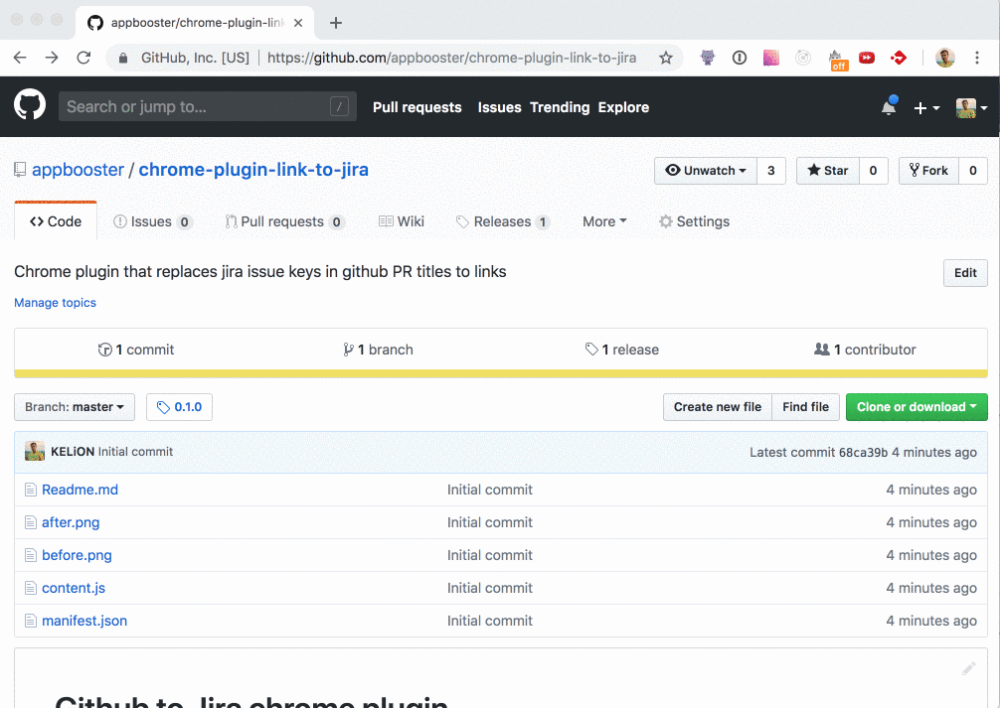

# Github to Jira chrome plugin
Chrome plugin that replaces all jira issue keys in github PR title to links to that issues:

Before:

After 

## How to install

* Download .crx file from the latest [release](https://github.com/appbooster/chrom-plugin-link-to-jira/)
* Open chrome://extensions
* Drag-n-drop downloaded file to the extensions list
